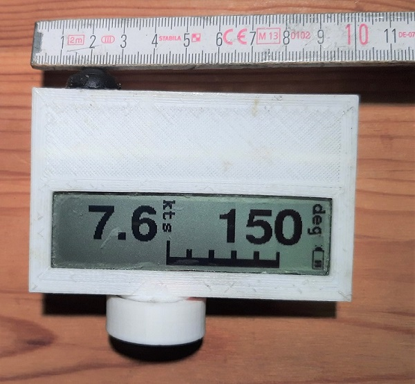
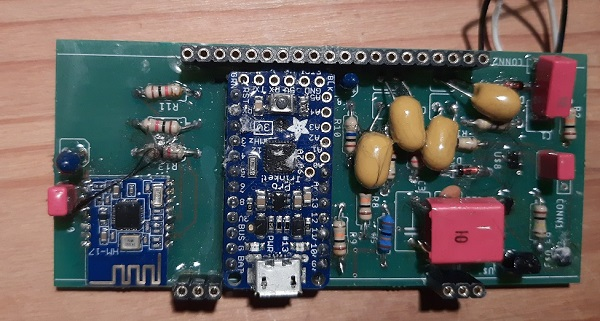
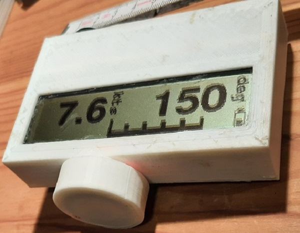
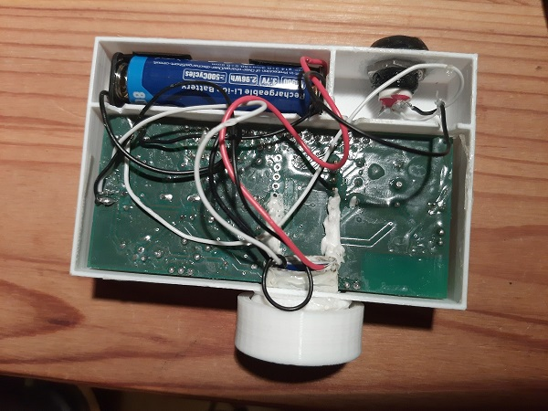
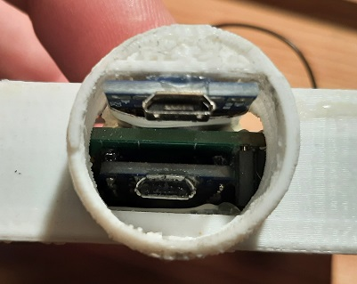

# bluetoothDisplay240

A bluetooth display for displaying speed, direction and a direction deviation bar while sailing.
Speed, direction and direction deviation measurements are transmitted via bluetooth, 
e.g. by a smartphone. The sum of component prices is about 100€.

This project contains
- The PCB and schematic of the circuit board in the [hardware](hardware) directory
- The code for the arduino compatible microcontroller on the circuit board in the [software](software) directory
- a Housing for 3D Printing  in the [housing](housing) directory
  (alternatively, you can use a commercial housing)

At the time of writing, material costs were approximately 100€. 
The electronics runs with 3.3V supply voltage, so it can be operated using a single LI-Ion battery.
The electronics draws about 15 mA supply current, so that with a 800m mAH battery, 
operation time is more than 50h without reloading.

## Electronics

The main components of the ectronics are an arduino-compatible microcontroller board,
a graphical LCD Display with 240x64 pixels, and a Bluetooth Low Energy board. 
Discrete components are used for a soft-power latch and a battery watchdog. 

The quiescent current while being switched off is less than 1 μA,
so the standby-time for a 800 mA battery is only limited by the self-discharge time
of the battery.

The LCD display can be plugged in via socket rows. 
In my experience, not all socker rows provide a good contact to the LCD Display,
I had better experiences with the cheaper ones.

The arduino compatible board is soldered on using post rows, so that there is a small gap 
between the PCB and the arduino compatible board.

The press-button switch should only provide contact while pressed.
If a waterproof housing is wanted, the switch should be at least IP67 classed.

The battery charging circuit board in the BOM provides 1A of charging current.
I prefer a lower charging current of 250 mA, for which the R3 Resistor 
on the charging circuit board must be replaced by a 4k7 SMD resistor.
The charging PCB and the Arduino compatible board both use their own micro USB socket;
note that charging is not possible using the Arduino-compatible board USB socket, 
and programming is not possible using the charging board USB socket.

The current PCB design has a small flaw because the large foil condensators must lie on the PCB
rather than stand; but there is no explicit place reserved for that. 
So these condensators must be laid on top of other components, which worked for me.

The components needed are listed in the [Bill of Material (BOM)](hardware/bom.md). 
I obtained most of the components from the distributor [Reichelt](https://www.reichelt.de).
For your convenience, I have a public list there 
[https://www.reichelt.de/my/1939286](https://www.reichelt.de/my/1939286) 
containing the components marked in the BOM.
The HM 17 Bluetooth module was obtained from an ebay shop,
the non-marked resistors from a resistor assortment and the litz wire also from Reichelt.
Feel free to purchase the components where you want,
I do not earn anything if you purchase from Reichelt!

Then you need the PCB, I had mine made by [Aisler](https://aisler.net/), but again feel free to use another manufacturer.

Approximate prices at the time of writing were

| **Item**      | **material** | **shipping** |
| ------------- | ------------ | ------------ |
| Reichelt List | 70€          | 6€           |
| HM17          | 11€          | 3€           |
| PCB           | 13€ for a batch of 3 | -    |

which adds up to about 100€ for one display.

### Assembly

You need a soldering iron with a small tip and soldering lead.
There are three SMD FET's on the PCB, which can be soldered with a soldering iron.
This can be a little tricky for an inexperienced solderer like me, but it worked in the end.
I'd recommend to solder the SMD FETs at the beginning, because then there is a 
Then, the film capacitors should be soldered at the end and with as much spare wire above the PCB as possible,
because they need to be bent in order to put the LCD display on top.

The battery holder should be connected to the charging board, 
which in turn should be connected to CONN1 using litz wire.
The push-Button switch should be connected to CONN2 also using litz wire.

You can consider to lacquer the board after all is finished and tested to improve water resistance. 
Be sure not to lacquer the pin rows, the lacquer tends to creep up in the pin holes.

## Software

You need to load the software onto the arduino compatible microcontroller board, e.g. using the Arduino IDE
and a micro USB cable. Make sure to select the correct board (Adafruit Trinket 3V) 
and the correct Programmer (USBtinyISP) in the Arduino IDE.

A good test is to try and upload a simple Arduino demo program (e.g. blink) onto the board 
before it is soldered in to make sure everything works as expected.

As the USB port on the microcontroller board is software-implemented,
new USB 3.0 ports typically lead to upload errors. 
The solution in my case was to use a cheap USB 2.0 hub between the PC and the microcontroller board.

To feed the display, I use my [Saillogger](https://github.com/thomasfox/saillogger) App.

## Bluetooth Low Energy Protocol

The bluetooth low energy (BLE) transmission protocol is very simple: 
The feeding device writes the field identifier, a colon (:) and the value of the addressed field
to the one BLE characteristic offered by the device's BLE receiver. After that, the sending device needs to wait some time
(should be some 10 ms, I still need to find out how long) before sending the next value.

The field id is f1 for the velocity field, f2 for the direction field and f3 for the direction bar.
For the f1 and f2 fields, the value can be any short string containing the characters a-z, A-Z, 0-9 or .,:
(short meaning the value fits in the field's window in the display).
For the f3 field, the value needs to be an integer value between -100 and 100.
The character ';' should act as a field separator (I need to verify whether that works).

For the used characteristic, the service uuid is "0000ffe0-0000-1000-8000-00805f9b34fb"
and the characteristic uuid is "0000ffe1-0000-1000-8000-00805f9b34fb"

You can use https://github.com/thomasfox/saillogger/blob/master/app/src/main/java/com/github/thomasfox/saildata/sender/BleSender.java
as a java/android code example for a bluetooth sender.

## Housing

The Housing consists of the main housing, a lid which is glued to the main housing, 
and a screw-lid through which the two USB sockets can be accessed. 
They can be 3D printed, I used PLA as printing material.

For a waterproof screw-lid, an o-ring is needed with an inner diameter of 20mm 
and a material diameter of 2mm.

The LCD Display is glued in the main housing, such that no water can enter between housing and Display.
Then the charging board is glued into the tube of the screw-lid, and the switch and battery holder 
are also glued into place.
Then the circuit board is connected to the LCD display, and the lid is glued an, 
also in such a way that no water can enter.

For gluing, I used pattex repair glue, which is transparent and stays flexible when cured, but any similar glue will do.

## Alternative Housing

I had some difficulties in getting my own housing really waterproof, so as an alternative
you can use a commercial housing. I used the 130x80x35mm FIBOX PC 100/35 LT Housing, 
which was available at the time of writing for €17 plus 5€ shipping from [Conrad](https://www.conrad.de).
The LCD needs to be glued to the transparent cover; I glued just the edges. 
Also a hole needs to be drilled for the push-button switch, which then also needs to be glued in.

## Questions?

Please open a [issue](../../issues) if you have any questions.